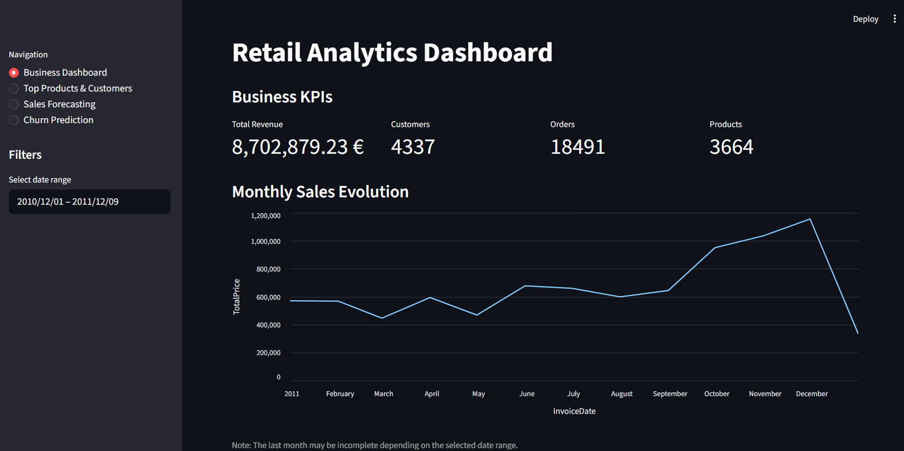
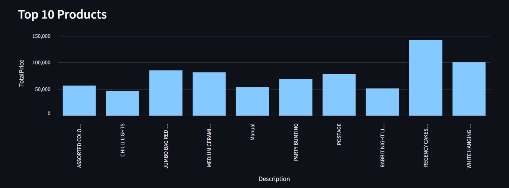
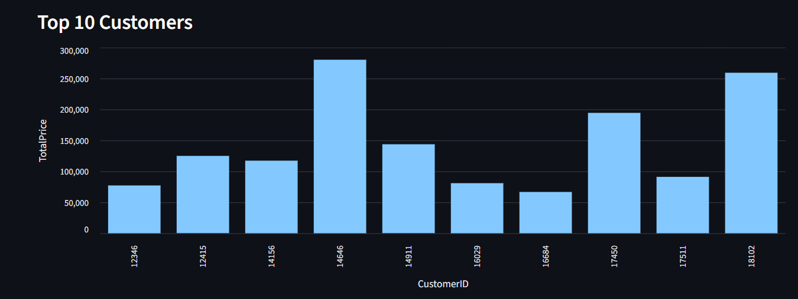
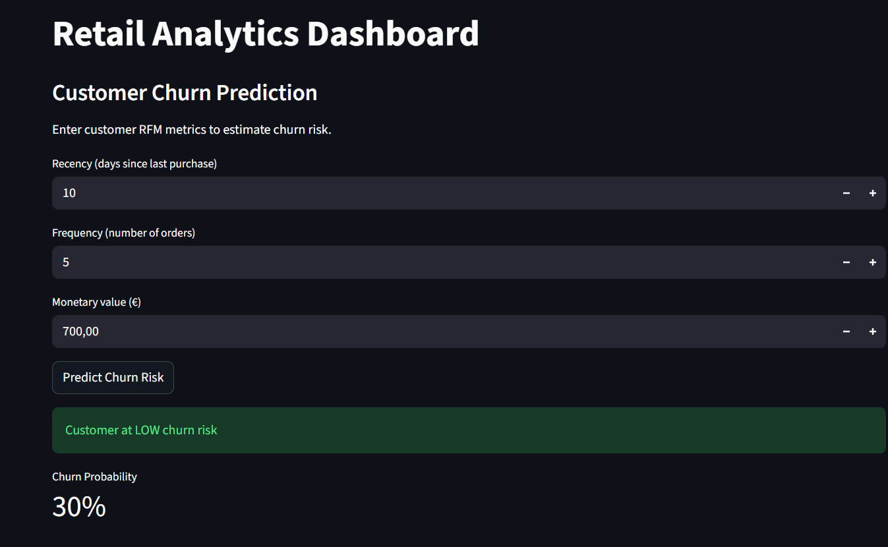
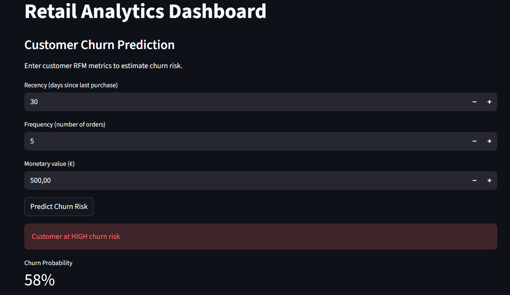

# Retail Analytics Project

# Retail Analytics Dashboard

An end-to-end data analytics project including:

- Business KPIs dashboard
- Sales analysis
- Sales forecasting (Prophet)
- Customer churn prediction (XGBoost + RFM)
- Interactive Streamlit app

## Live Demo
👉 https://ton-app.streamlit.app

## Project Overview
This project builds an end-to-end data analytics pipeline to analyze retail sales data, uncover customer behavior, and generate actionable business insights.

It simulates a real-world data workflow, from data ingestion and transformation to database storage, analysis, visualization, and deployment.

## Tech Stack

Python (Pandas, NumPy, SQLAlchemy)
PostgreSQL
SQL
Power BI
Docker
Git & GitHub
GitHub Actions (CI/CD)
Microsoft Azure PostgreSQL Flexible Server
Project Architecture
Raw Data → Python ETL Pipeline → PostgreSQL Database → SQL Analysis → Power BI Dashboard → Business Insights

## Key Features

- Designed and implemented an ETL pipeline in Python for data cleaning and transformation
- Built a relational database using PostgreSQL (fact and dimension tables)
- Performed analytical queries using SQL to extract business insights
- Developed an interactive Power BI dashboard for KPI monitoring
- Containerized the data pipeline using Docker for reproducibility
- Implemented CI/CD with GitHub Actions
- Deployed PostgreSQL on Microsoft Azure to simulate a cloud environment

## Business KPIs

The dashboard focuses on:

- Revenue trends
- Customer segmentation (RFM)
- Regional sales performance
- Monthly sales evolution
- Top-performing customers
- Business recommendations

## Key Business Insights

- The company generated approximately 8.9M in total revenue
- Revenue is highly concentrated in the United Kingdom, indicating strong dependency on a single market
- Around 33% of customers are at risk of churn, highlighting a major retention challenge
- A small group of 274 VIP customers drives a significant portion of total revenue

## Power BI Dashboard

### Dashboard Preview


---

## Docker Usage

Build the Docker image:

```bash
docker build -t retail-analytics-project .
```

Run the container:

```bash
docker run retail-analytics-project
```

---

## Cloud Deployment

PostgreSQL was deployed to Microsoft Azure PostgreSQL Flexible Server to simulate a production-ready cloud architecture.

This project demonstrates both:

- Local deployment (Docker + PostgreSQL)
- Cloud deployment (Azure PostgreSQL)

---

## CI/CD

GitHub Actions automatically verifies project quality on each push to GitHub.

---

## Machine Learning – Customer Churn Prediction

## Objective

Predict customer churn to help the business identify and retain at-risk customers.

## Approach

Features built from historical data (before cutoff date)
Churn defined using future behavior (after cutoff date)
Prevents data leakage and reflects real-world conditions

## Models

Logistic Regression (baseline)
Random Forest
XGBoost

## Final Model

XGBoost with optimized threshold (0.4)

Recall ≈ 90% → detects most churn customers
ROC AUC ≈ 0.78 → solid performance

---

## Conclusion - Sales Forecasting

In this section, we performed a revenue forecasting analysis based on historical sales data.

First, the `InvoiceDate` column was converted into a datetime format to enable proper time series analysis. Then, transactional data was aggregated on a monthly basis using the `TotalPrice` variable. This step transforms individual sales into a monthly time series that can be used by a forecasting model.

The model used is Prophet. This choice is appropriate because Prophet is designed for business time series data and allows easy modeling of trends over time.

The results show an overall upward trend in revenue. The model predicts continuous growth in the coming months, with revenue expected to reach around one million euros.

To evaluate the model, a time-based split was performed: the last few months were used as test data. The following metrics were obtained:

- MAE ≈ 304,966 €
- RMSE ≈ 308,020 €

These results indicate that the model captures the general trend, but the error remains relatively high. This can be explained by the limited amount of available data (only 13 months) and the significant variability in monthly revenue.

In conclusion, Prophet provides a solid baseline for understanding sales trends and forecasting future revenue. However, improving the model’s accuracy would require more historical data and potentially the inclusion of additional explanatory variables such as promotions, seasonal effects, or special business events.

---

## Dashboard



---

## Top Products



---

## Top Customers



---

## Churn Prediction





---

## Author

Sidbewendin Angelique Yameogo