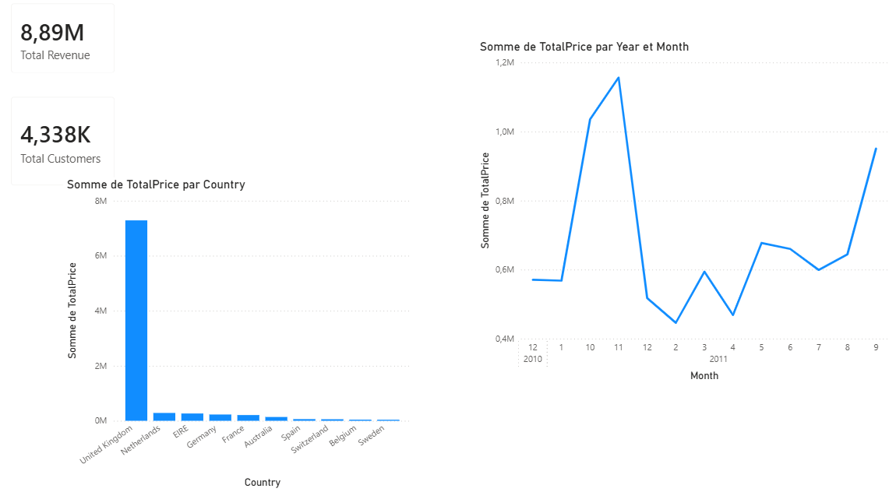
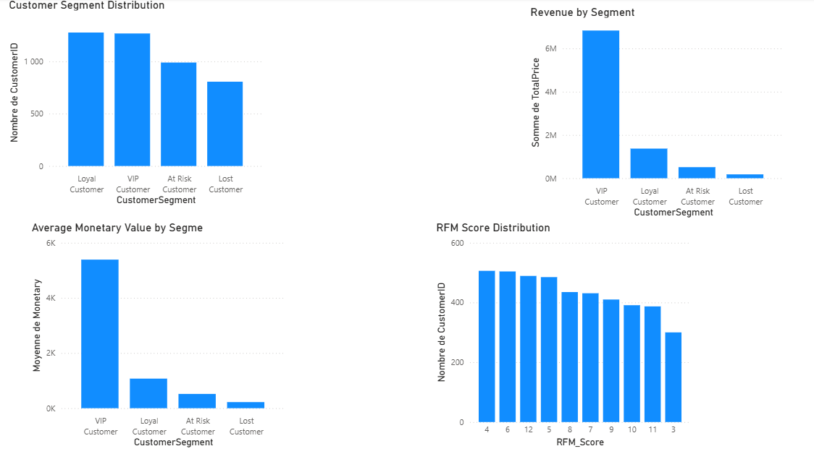
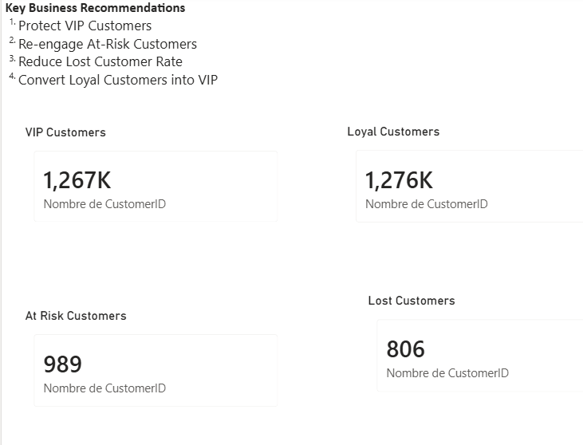
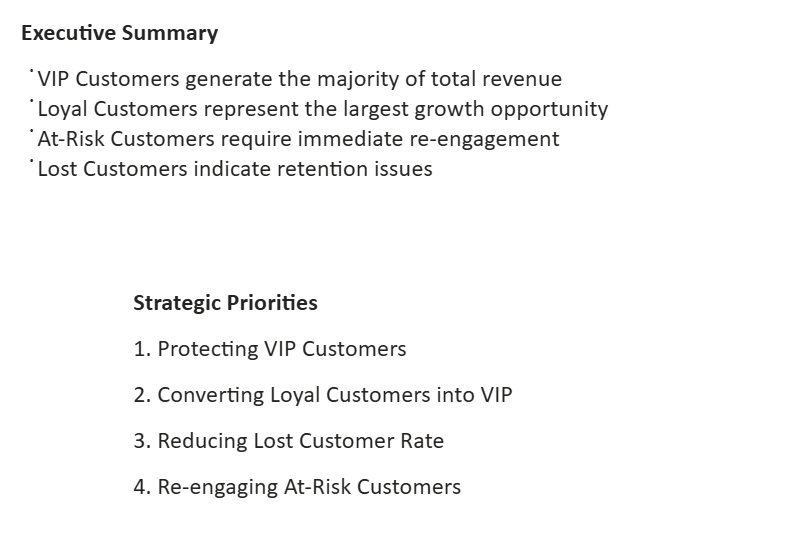

# Retail Analytics Project

## Project Overview
This project builds an end-to-end data analytics pipeline to analyze retail sales data, uncover customer behavior, and generate actionable business insights.

It simulates a real-world data workflow, from data ingestion and transformation to database storage, analysis, visualization, and deployment.

## Tech Stack

Python (Pandas, NumPy, SQLAlchemy)
PostgreSQL
SQL
Power BI
Docker
Git & GitHub
GitHub Actions (CI/CD)
Microsoft Azure PostgreSQL Flexible Server
Project Architecture
Raw Data → Python ETL Pipeline → PostgreSQL Database → SQL Analysis → Power BI Dashboard → Business Insights

## Key Features

- Designed and implemented an ETL pipeline in Python for data cleaning and transformation
- Built a relational database using PostgreSQL (fact and dimension tables)
- Performed analytical queries using SQL to extract business insights
- Developed an interactive Power BI dashboard for KPI monitoring
- Containerized the data pipeline using Docker for reproducibility
- Implemented CI/CD with GitHub Actions
- Deployed PostgreSQL on Microsoft Azure to simulate a cloud environment

## Business KPIs

The dashboard focuses on:

- Revenue trends
- Customer segmentation (RFM)
- Regional sales performance
- Monthly sales evolution
- Top-performing customers
- Business recommendations

## Key Business Insights

- The company generated approximately 8.9M in total revenue
- Revenue is highly concentrated in the United Kingdom, indicating strong dependency on a single market
- Around 33% of customers are at risk of churn, highlighting a major retention challenge
- A small group of 274 VIP customers drives a significant portion of total revenue

## Power BI Dashboard

### Dashboard Preview









---

## Docker Usage

Build the Docker image:

```bash
docker build -t retail-analytics-project .
```

Run the container:

```bash
docker run retail-analytics-project
```

---

## Cloud Deployment

PostgreSQL was deployed to Microsoft Azure PostgreSQL Flexible Server to simulate a production-ready cloud architecture.

This project demonstrates both:

- Local deployment (Docker + PostgreSQL)
- Cloud deployment (Azure PostgreSQL)

---

## CI/CD

GitHub Actions automatically verifies project quality on each push to GitHub.

---

## Author

Sidbewendin Angelique Yameogo